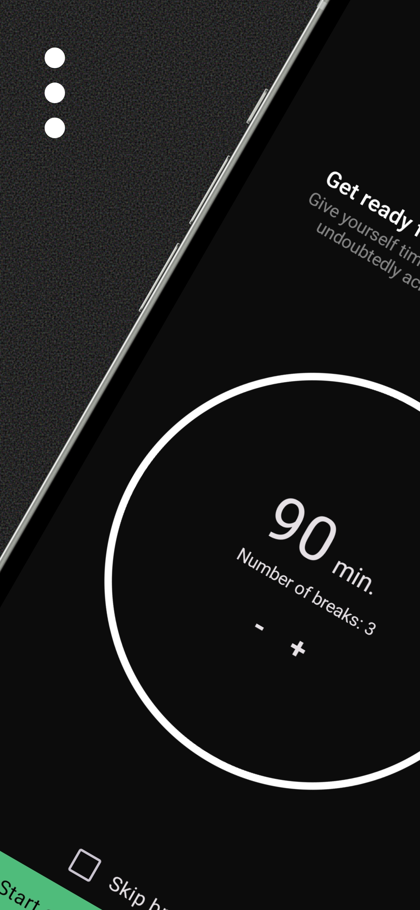
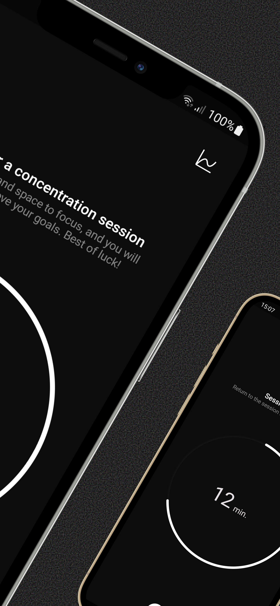

# App Name

  
  
   
  
  

## Description
Our native Android application is a powerful tool for increasing productivity and efficiency at work. It allows for personalized work sessions, breaks, and progress tracking.

## Features

- Work Time Customization: Adjust the length of your work sessions based on your preferences, from short bursts of focused work to longer periods of deep work.

- Automatic Breaks: For longer work sessions, the app intelligently inserts breaks to provide rejuvenation and prevent burnout.

- Statistics and Progress: Track your accomplishments with detailed statistics that provide insights into your completed work and enable progress evaluation.

- Notifications and Reminders: The app sends subtle notifications, reminding you to take breaks and transition between work sessions to maintain focus and workflow.

- Customization: Personalize the app to your preferences, create to-do lists, set reminders, and customize the app's appearance.

## Installation

1. Clone the repository: `git clone https://github.com/username/repo.git`

## Contribution

We welcome contributions to the development of the application. If you have any ideas, suggestions, or would like to contribute, please submit issues or create pull requests.

## Contact

For any questions, suggestions, or assistance, please contact our team at kustraslawomir@gmail.com

Thank you for using our application!

